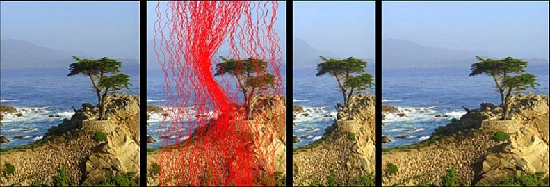
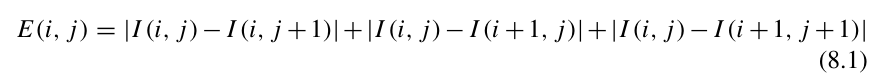

# Parallel Seam Carving Using CUDA



## Abstract
Effective resizing of images should not only use geometric constraints, but consider the image content as well. We present a simple image operator called seam carving that supports content-aware image resizing for both reduction and expansion. A seam is an optimal 8-connected path of pixels on a single image from top to bottom, or left to right, where optimality is defined by an image energy function. By repeatedly carving out or inserting seams in one direction we can change the aspect ratio of an image. By applying these operators in both directions we can retarget the image to a new size. The selection and order of seams protect the content of the image, as defined by the energy function. Seam carving can also be used for image content enhancement and object removal. We support various visual saliency measures for defining the energy of an image, and can also include user input to guide the process. By storing the order of seams in an image we create multi-size images, that are able to continuously change in real time to fit a given size.

## CPU and GPU Implementation

This implementation is a mere prototype. 

### Energy Function:
The energy function I used is very simple and is embarrassingly parallel. I found it in the book referenced below.



### TODO (Improvements I plan to add some time in the future to improve performance):
1. Squish the kernels into just one or two functions.
2. Load pixels into shared memory instead of reading from global memory everytime. Then proceed with computations.
3. Instead of removing the seam for everything iteration, I should somehow mark the seams to be removed - possibly by setting the minimum seam weights to infinity. The current implementation has a huge penalty on performance because for every iteration of seam removal, I am allocating a new matrix in the GPU. Obviously, `cudaMalloc` and `cudaMemcpy` are very costly. But this is just a prototype.

## Usage:

The binary can be found in the 'bin' folder. `cd` into that folder, then run the binary with the right arguments.

```
Usage: ./SeamCarving <Image_Path> <Runner> <Resize> <Resize_Factor>
       <Image_Path> -> Absolute/Relative path to the image
       <Runner> - CPU | GPU | BOTH
       <Resize> - Decrease = 0, Increase = 1
       <Resize Factor> - # of pixels to reduce horizontally

Example: ./SeamCarving ../images/lake.jpg BOTH 0 100

```

You would need at least the pascal architecture to run the GPU implementation. 

 ---
## Sources
Seam Carving Paper: https://faculty.idc.ac.il/arik/SCWeb/imret/

Energy function is used from this book (page 225): [Introduction to Parallel Computing - From Algorithms to Programming on State-of-the-Art Platforms](https://link.springer.com/book/10.1007/978-3-319-98833-7)